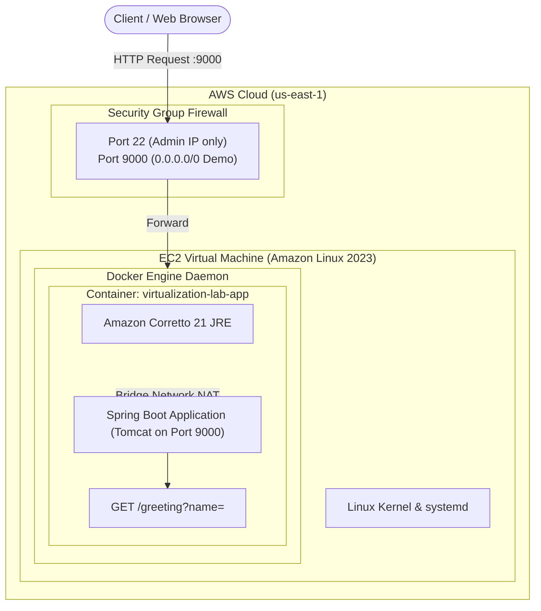

# Containerizing and Deploying a Java Web Application (`virtualization-lab`)

## 1. Project Description and Learning Objectives
This project is a comprehensive workshop on modern application packaging, virtualization, container orchestration, and cloud deployment using Java, Docker, Docker Compose, and Amazon Web Services (AWS) EC2.

### Learning Objectives
- Containerize a Spring Boot application using official Amazon Corretto 21 container images.
- Master port binding, environment variable configuration, and container network isolation.
- Orchestrate multi-tier container topologies with Docker Compose v2 (Web application and MongoDB database).
- Publish container artifacts to Docker Hub under versioned and `latest` tags.
- Provision and configure an Amazon Linux 2023 virtual machine in AWS EC2 to run containerized workloads securely.
- Evaluate operational cloud infrastructure costs across multiple traffic scales using AWS Pricing Calculator.

---

## 2. Technology Stack and Versions
- **Programming Language:** Java 21 (Amazon Corretto 21)
- **Build Tool:** Apache Maven 3.9+
- **Application Framework:** Spring Boot 4.1.1 (`spring-boot-starter-web`, `spring-boot-starter-test`)
- **Container Runtime:** Docker Engine v24+ / Compose v2
- **Database (Orchestration):** MongoDB 8.0 (`mongo:8`)
- **Cloud Infrastructure:** AWS EC2 (Amazon Linux 2023 - AL2023, Kernel 6.1)

---

## 3. Repository Structure
```text
virtualization-lab/
├── pom.xml                 # Maven build file with Spring Boot 4.1.1
├── Dockerfile              # Container definition based on amazoncorretto:21
├── compose.yaml            # Docker Compose v2 multi-container orchestration
├── .dockerignore           # Context filter (includes target/ for fast image builds)
├── .gitignore              # Git ignore rules for Java/Maven/IDE
├── README.md               # Workshop guide and architecture documentation
├── docs/
│   ├── evidence/           # Screenshot evidence files (.gitkeep)
│   └── diagrams/           # Visual and architectural diagrams
└── src/
    ├── main/java/co/edu/escuelaing/
    │   ├── RestServiceApplication.java   # Application entry point with dynamic PORT resolution
    │   └── HelloRestController.java      # REST Controller for GET /greeting endpoint
    └── test/java/co/edu/escuelaing/
        └── HelloRestControllerTest.java  # MockMvc integration tests
```

---

## 4. Build and Execution Guide

### 4.1. Local Execution (Direct JVM)
Compile the project and run the generated executable JAR:
```bash
mvn clean package
java -jar target/virtualization-lab-1.0.0.jar
```
Verify the endpoint using `curl`:
```bash
curl -i "http://localhost:6000/greeting?name=Pedro"
```
*Expected output:* `HTTP/1.1 200 OK`, body: `Hello, Pedro!`.

---

### 4.2. Containerized Execution (Single Instance)
Build the Docker image:
```bash
docker build -t <dockerhub-user>/virtualization-lab:1.0 .
```
Verify the local image:
```bash
docker images
```
Run the container mapping host port `9000` to container port `9000`:
```bash
docker run -d -p 9000:9000 --name virtualization-lab-single <dockerhub-user>/virtualization-lab:1.0
```
Verify with `curl`:
```bash
curl -i "http://localhost:9000/greeting?name=Container"
```

---

### 4.3. Isolated Multi-Container Execution (3 Independent Instances)
Demonstrate process and network isolation by running three concurrent instances bound to separate host ports:
```bash
docker run -d -p 34000:9000 --name virtualization-lab-1 <dockerhub-user>/virtualization-lab:1.0
docker run -d -p 34001:9000 --name virtualization-lab-2 <dockerhub-user>/virtualization-lab:1.0
docker run -d -p 34002:9000 --name virtualization-lab-3 <dockerhub-user>/virtualization-lab:1.0
```
Inspect running containers:
```bash
docker ps
```
Verify each container independently:
```bash
curl -i "http://localhost:34000/greeting?name=Instance1"
curl -i "http://localhost:34001/greeting?name=Instance2"
curl -i "http://localhost:34002/greeting?name=Instance3"
```
*What this demonstrates:* Each container runs in complete isolation with its own private memory, file system, and network namespace. Port collisions are avoided by mapping different host ports to the identical internal container port `9000`.

Cleanup test instances:
```bash
docker rm -f virtualization-lab-1 virtualization-lab-2 virtualization-lab-3 virtualization-lab-single
```

---

### 4.4. Orchestration with Docker Compose
Start the multi-tier application stack (Spring Boot Web application + MongoDB 8):
```bash
docker compose up -d --build
```
Inspect status and service logs:
```bash
docker compose ps
docker compose logs web
docker compose logs db
```
Verify the web service over port `8087`:
```bash
curl -i "http://localhost:8087/greeting?name=Compose"
```
Interact with the MongoDB container via `mongosh`:
```bash
docker compose exec db mongosh
```
Inside the `mongosh` interactive shell:
```javascript
show dbs
use workshop
db.users.insertOne({ name: "Pedro", role: "Engineer", timestamp: new Date() })
db.users.find()
exit
```
Stop the Compose environment:
```bash
docker compose down
```
*What this demonstrates:*
1. **Service Discovery & DNS:** The `web` container communicates with MongoDB using the internal hostname `db` provided automatically by the Compose default bridge network.
2. **Volume Persistence:** MongoDB data is persisted in named volumes (`mongodb`, `mongodb_config`), surviving container teardowns.
3. **Dependency Management:** `depends_on: db` ensures startup ordering.

---

## 5. Environment Variables and Port Decision

### Port Resolution Strategy (6000 vs 9000)
The workshop specifications contained a dual port reference:
- Local documentation mentioned port `6000`.
- Container instructions specified port `9000`.

**Architectural Decision:**
In `RestServiceApplication.java`, dynamic port configuration is handled via:
```java
String port = System.getenv().getOrDefault("PORT", "6000");
app.setDefaultProperties(Collections.singletonMap("server.port", port));
```
- **Local execution (`java -jar`):** If no `PORT` variable is set, it defaults gracefully to `6000` (`http://localhost:6000`).
- **Container execution (`Dockerfile`):** Sets `ENV PORT=9000` and `EXPOSE 9000`, causing the Spring Boot container to listen on port `9000`.
- **Compose execution (`compose.yaml`):** Injects `PORT: 9000` and maps `8087:9000` on the host.

### Environment Variables Table
| Variable | Default Value | Description |
| :--- | :--- | :--- |
| `PORT` | `6000` (Local) / `9000` (Container) | HTTP listening port for Spring Boot Tomcat |
| `SPRING_DATA_MONGODB_URI` | `mongodb://db:27017/workshop` | Database connection string passed to container |

---

## 6. Docker Hub Publication
Login to Docker Hub:
```bash
docker login
```
Tag the built image with both explicit version `1.0` and `latest`:
```bash
docker tag <dockerhub-user>/virtualization-lab:1.0 <dockerhub-user>/virtualization-lab:latest
```
Push both tags to Docker Hub:
```bash
docker push <dockerhub-user>/virtualization-lab:1.0
docker push <dockerhub-user>/virtualization-lab:latest
```

**Docker Hub Repository URL:** `<PENDIENTE: URL del repositorio en Docker Hub>`

---

## 7. AWS EC2 Deployment Guide (Amazon Linux 2023)

### Step 1: Launch EC2 Instance
1. AMI: **Amazon Linux 2023 AMI** (64-bit x86_64).
2. Instance Type: `t2.micro` or `t3.micro` (AWS Free Tier eligible).
3. Key Pair: Create or select an existing `.pem` key.

### Step 2: Configure Security Group
| Type | Protocol | Port Range | Source | Description |
| :--- | :--- | :--- | :--- | :--- |
| SSH | TCP | 22 | `My IP` (`x.x.x.x/32`) | Secure administration only from operator IP |
| Custom TCP | TCP | 9000 (or 8087) | `0.0.0.0/0` | Public demo access for the workshop evaluation |

### Step 3: Connect and Install Docker
Connect to the instance via SSH:
```bash
ssh -i "your-key.pem" ec2-user@<EC2-PUBLIC-IP>
```
Update packages and install Docker:
```bash
sudo dnf update -y
sudo dnf install -y docker
sudo systemctl enable --now docker
sudo usermod -aG docker ec2-user
```
*Note:* Log out and log back in for the group membership to take effect.

### Step 4: Run Application Container
```bash
docker run -d \
  --name virtualization-lab-app \
  --restart unless-stopped \
  -p 9000:9000 \
  <dockerhub-user>/virtualization-lab:latest
```

### Step 5: Verification
From your local terminal or browser:
```bash
curl -i "http://<EC2-PUBLIC-IP>:9000/greeting?name=AWS"
```
Browser URL: `http://<EC2-PUBLIC-IP>:9000/greeting?name=AWS`

**Public EC2 Application URL:** `<PENDIENTE: http://<EC2-PUBLIC-IP>:9000/greeting?name=AWS>`

> [!CAUTION]
> Remember to **Terminate** or **Stop** the EC2 instance in the AWS Management Console after testing to avoid unexpected charges.

---

## 8. Deployment Model Architecture



### Layer Responsibilities
1. **Security Group:** State-level virtual firewall at the hypervisor boundary. Filters inbound and outbound network packets before reaching the VM network interface.
2. **EC2 Virtual Machine:** Provides isolated compute, RAM, vCPU, and persistent EBS storage running Amazon Linux 2023.
3. **Docker Engine:** Manages container lifecycle, image layers, namespace isolation (PID, mount, network), cgroups resource constraints, and bridge network port forwarding.
4. **Spring Boot Application:** Houses business logic, embedded Tomcat web server, REST controllers, and request lifecycle management.

---

## 9. AWS Cost Analysis

### 9.1. Workload Assumptions Table
Calculated across three monthly traffic levels (10,000, 100,000, and 1,000,000 requests/month).

*Traffic Parameters:*
- Average HTTP Request size: `0.5 KB`
- Average HTTP Response size: `1.5 KB`
- Total transfer per request: `2.0 KB` (`0.000001907 GB`)
- Baseline Region: `us-east-1` (N. Virginia)
- Storage: `30 GB General Purpose SSD (gp3)` per instance
- Instance Type: `t3.micro` (2 vCPUs, 1.0 GiB RAM)
- Operating System: `Linux` (Amazon Linux 2023)

| Metric / Scenario | Scenario A: Low (10,000 req/mo) | Scenario B: Medium (100,000 req/mo) | Scenario C: High (1,000,000 req/mo) |
| :--- | :--- | :--- | :--- |
| **Monthly Requests** | 10,000 | 100,000 | 1,000,000 |
| **Outbound Data Transfer** | 10,000 × 1.5 KB = **15.0 MB (0.015 GB)** | 100,000 × 1.5 KB = **150.0 MB (0.150 GB)** | 1,000,000 × 1.5 KB = **1.50 GB** |
| **Inbound Data Transfer** | 10,000 × 0.5 KB = **5.0 MB (0.005 GB)** | 100,000 × 0.5 KB = **50.0 MB (0.050 GB)** | 1,000,000 × 0.5 KB = **0.50 GB** |
| **Instance Type** | 1 × `t3.micro` | 1 × `t3.micro` | 2 × `t3.micro` (Load Balanced) |
| **Hours per Month** | 730 hours (Continuous 24/7) | 730 hours (Continuous 24/7) | 1,460 hours (2 instances 24/7) |
| **EBS Storage (gp3)** | 30 GB | 30 GB | 60 GB (30 GB × 2) |
| **High Availability (HA)** | No (Single AZ) | No (Single AZ) | Yes (Multi-AZ with ALB) |

---

### 9.2. Monthly Cost Estimation Table
> Formula: $\text{Cost per Request} = \frac{\text{Total Monthly Cost}}{\text{Monthly Requests}}$

| Scenario | Compute (EC2) | Storage (EBS gp3) | Data Transfer Out | ALB / Addons | Total Monthly Cost | Cost per Request |
| :--- | :--- | :--- | :--- | :--- | :--- | :--- |
| **10,000 req/mo** | `<PENDIENTE: AWS Pricing Calculator>` | `<PENDIENTE: AWS Pricing Calculator>` | `<PENDIENTE: AWS Pricing Calculator>` | \$0.00 | `<PENDIENTE: Total>` | `<PENDIENTE: Cost/Req>` |
| **100,000 req/mo** | `<PENDIENTE: AWS Pricing Calculator>` | `<PENDIENTE: AWS Pricing Calculator>` | `<PENDIENTE: AWS Pricing Calculator>` | \$0.00 | `<PENDIENTE: Total>` | `<PENDIENTE: Cost/Req>` |
| **1,000,000 req/mo**| `<PENDIENTE: AWS Pricing Calculator>` | `<PENDIENTE: AWS Pricing Calculator>` | `<PENDIENTE: AWS Pricing Calculator>` | `<PENDIENTE: ALB>` | `<PENDIENTE: Total>` | `<PENDIENTE: Cost/Req>` |

---

### 9.3. Instructions to Input into AWS Pricing Calculator
To obtain exact cost figures from [AWS Pricing Calculator](https://calculator.aws/):
1. **Location:** Select Region `US East (N. Virginia) us-east-1`.
2. **Add Service: Amazon EC2**
   - Operating System: `Linux`.
   - Workload: `Consistent Performance`.
   - Instance Type: `t3.micro` (1 instance for 10k/100k; 2 instances for 1M).
   - Payment Option: `On-Demand`, 100% utilization (730 hours/month).
   - Storage (EBS): `General Purpose SSD (gp3)`, `30 GB`.
   - Data Transfer: Outbound Internet data transfer (`0.015 GB` for 10k, `0.150 GB` for 100k, `1.50 GB` for 1M).
3. **Add Service: Elastic Load Balancing (Only for Scenario C - 1M req/mo)**
   - Type: `Application Load Balancer`.
   - Processed bytes: `2.0 GB/month`.
   - Target: 2 instances.

---

### 9.4. Architectural Cost Answers

#### 1. What is the base cost of running an EC2 instance regardless of traffic?
The base cost consists of fixed compute hours (~730 hours/month for a 24/7 running instance) plus allocated EBS root volume storage (e.g., 30 GB gp3). Whether the instance serves 0 requests or 10,000 requests, the virtual machine is powered on and dedicated, incurring a constant baseline charge (~$7.50 - $10.00/month for a `t3.micro` without Free Tier).

#### 2. At what traffic level does the fixed infrastructure cost become negligible compared to per-request scaling?
As traffic scales towards hundreds of thousands to millions of requests per month, the fixed VM and storage cost is amortized across millions of transactions, driving the cost-per-request down by several orders of magnitude ($0.0008/req at 10k down to $0.00001/req at 1M). At high volume, marginal costs shift towards data egress and auto-scaled compute capacity.

#### 3. When is it necessary to scale from a single EC2 instance to multiple instances?
Scaling to multiple instances becomes mandatory when:
- **CPU/Memory Saturation:** The application exceeds 70-80% sustained CPU or exhausts JVM heap under peak concurrency.
- **High Availability (HA) & SLA:** A single instance represents a Single Point of Failure (SPOF). Production resiliency requires multi-AZ redundancy behind an Application Load Balancer.
- **Zero-Downtime Deployments:** Rolling updates or blue/green deployments require multiple running targets.

#### 4. What additional AWS production services are required beyond a raw EC2 instance?
In a robust production environment, raw EC2 must be augmented with:
- **Application Load Balancer (ALB):** SSL termination, health checks, and traffic distribution.
- **Auto Scaling Group (ASG):** Elastic scaling based on CPU/Request count metrics.
- **Amazon CloudWatch:** Logging, alarms, and performance monitoring.
- **AWS Secrets Manager / Parameter Store:** Secure credential and configuration injection.
- **Amazon Route 53 & AWS Certificate Manager (ACM):** DNS routing and managed TLS/SSL certificates.
- **Amazon Managed Database (DocumentDB / MongoDB Atlas on AWS):** Managed data tier with automated backups and replication.

#### 5. Would a Serverless architecture (AWS Lambda + API Gateway) be more cost-effective for the low-traffic scenario (10,000 req/month)?
**Yes, significantly.** 
- **Traffic Characterization:** 10,000 requests per month corresponds to an average of only **0.0038 requests per second** (one request every ~4.3 minutes) with prolonged idle periods.
- **Cost Comparison:** In EC2, you pay for 730 idle hours of compute ($~8-$10/mo). In AWS Lambda, compute is billed exclusively during execution duration (e.g., 50ms per invocation). 10,000 invocations fall well within the permanent AWS Lambda Free Tier (1M free requests/month and 3.2M seconds of compute), costing **$0.00** in compute and under **$0.04** in API Gateway calls, resulting in virtually **~99% cost reduction** for intermittent workloads.

#### Conclusion on EC2 Suitability
EC2 is an excellent, predictable compute platform for sustained, steady-state workloads and containerized microservices requiring persistent memory residency or specific OS configurations. However, for low-volume, bursty, or intermittent workloads, container serverless (AWS ECS Fargate / AWS App Runner) or function serverless (AWS Lambda) offers superior cost efficiency and operational simplicity.

---

## 10. Evidence Section
Place screenshots and operational artifacts inside `docs/evidence/` using the specified filenames:

| Evidence Item | Filename / Placeholder | Description |
| :--- | :--- | :--- |
| **Local Execution** | `docs/evidence/01_local_run.png` | Terminal output of `mvn clean package` and `curl http://localhost:6000/greeting` |
| **Docker Build** | `docs/evidence/02_docker_images.png` | Output of `docker build` and `docker images` showing `<dockerhub-user>/virtualization-lab:1.0` |
| **Isolated Containers** | `docs/evidence/03_isolated_containers.png` | Output of `docker ps` and curl calls to ports `34000`, `34001`, `34002` |
| **Docker Compose** | `docs/evidence/04_compose_stack.png` | Output of `docker compose up -d`, `docker compose ps`, and `mongosh` session |
| **Docker Hub Registry** | `docs/evidence/05_dockerhub_repo.png` | Web browser view of Docker Hub repository with tags `1.0` and `latest` |
| **EC2 Deployment** | `docs/evidence/06_ec2_deployment.png` | SSH session on Amazon Linux 2023 showing `docker ps` and `docker logs` |
| **EC2 Browser Verification**| `docs/evidence/07_ec2_browser_greeting.png` | Browser visiting `http://<EC2-IP>:9000/greeting?name=AWS` |
| **AWS Pricing Calculator** | `docs/evidence/08_aws_calculator_estimate.png` | Screenshot / PDF export of the completed estimate on calculator.aws |

---

## 11. Test Execution and Results
Integration tests verify endpoint behavior, parameter handling, and status codes using Spring Boot MockMvc:
```bash
mvn test
```
**Test Results Summary:**
- `greetingShouldReturnDefaultMessage()`: Verifies `GET /greeting` returns `HTTP 200` and `Hello, World!`. **(PASSED)**
- `greetingShouldReturnCustomMessageWhenNameProvided()`: Verifies `GET /greeting?name=Pedro` returns `HTTP 200` and `Hello, Pedro!`. **(PASSED)**

---

## 12. Limitations and Lessons Learned
- **Stateless Web Tier:** The Spring Boot application currently operates without direct persistence logic, serving as a clean microservice containerization prototype.
- **Docker Compose Networking:** Learned how internal DNS resolution abstracts host IP addresses using service names (`db`), allowing seamless container interoperability.
- **Cloud Security Best Practices:** Learned the principle of least privilege in EC2 Security Groups by restricting administrative SSH access to operator IPs while exposing only necessary application ports for verification.
