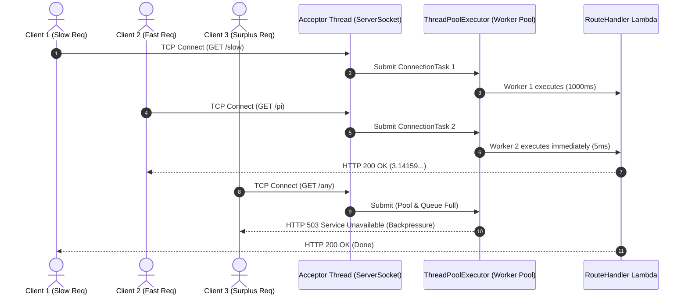
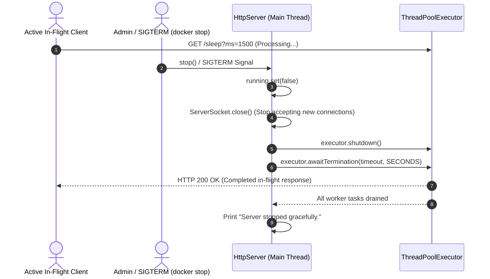

# Mini Web Framework: Concurrent Extension & Cloud Deployment

## 1. Overview and Architecture
The **Mini Web Framework** is a lightweight, zero-dependency HTTP/1.1 web framework and application server developed exclusively with standard Java 21 (`java.net`, `java.util.concurrent`, `java.io`, `java.nio`).

It offers a clean, expressive DSL inspired by modern micro-frameworks (e.g. SparkJava/Express) to define routes, serve static assets, process requests concurrently, and gracefully shut down without third-party web dependencies.

```text
mini-web-framework/
├── pom.xml                 # Maven build file targeting Java 21 and Shade packaging
├── Dockerfile              # Multi-stage build (maven:3.9-amazoncorretto-21 -> amazoncorretto:21-alpine)
├── .dockerignore           # Build context filter
├── .gitignore              # Git ignore rules
├── README.md               # Technical documentation and operations manual
├── docs/
│   ├── evidence/           # Screenshot evidence files (.gitkeep)
│   └── diagrams/           # Architecture and sequence diagrams
└── src/
    ├── main/java/co/edu/escuelaing/
    │   ├── app/
    │   │   └── Application.java        # Reference web application with dynamic & static endpoints
    │   └── webframework/
    │       ├── WebFramework.java       # Static façade DSL API (staticfiles, get, start, stop)
    │       ├── HttpServer.java         # Concurrent HTTP server with bounded ThreadPool & graceful shutdown
    │       ├── Router.java             # Lock-free ConcurrentHashMap route registry
    │       ├── Request.java            # Immutable per-request URI/parameter abstraction
    │       ├── Response.java           # Thread-isolated HTTP response builder
    │       ├── RouteHandler.java       # Functional route lambda interface
    │       └── StaticFileService.java  # Thread-safe static resource provider with path traversal defenses
    └── test/java/co/edu/escuelaing/
        └── webframework/
            ├── ConcurrencyTest.java              # 5 parallel requests in ~1s vs ~5s sequential comparison
            ├── GracefulShutdownTest.java         # In-flight request draining, SIGTERM, /shutdown endpoint tests
            ├── SaturationTest.java               # HTTP 503 backpressure under thread pool saturation
            ├── RequestTest.java                  # Query string parameter parsing unit tests
            ├── RouterTest.java                   # Route mapping and normalization tests
            ├── StaticFileServiceTest.java        # Static asset lookup and path traversal defense tests
            └── WebFrameworkIntegrationTest.java  # Full end-to-end integration test suite
```

---

## 2. Extension Evolution: Before vs. After

### 2.1. Comparison Matrix
| Architectural Feature | Baseline Version | Extended Version |
| :--- | :--- | :--- |
| **Concurrency Model** | Strictly sequential (1 request at a time) | Multi-threaded acceptor with bounded `ThreadPoolExecutor` |
| **Throughput ($N \times 1\text{s}$ requests)** | Serial execution ($N$ seconds) | Concurrent execution ($\approx 1$ second) |
| **Overload Protection** | None (unbounded OS TCP backlog queue) | Bounded queue with HTTP `503 Service Unavailable` rejection |
| **Shutdown Behavior** | Immediate socket cut / process termination | Graceful draining of in-flight requests + JVM SIGTERM hook |
| **Thread Safety** | Single-thread assumptions | `ConcurrentHashMap`, `volatile` folders, isolated request objects |
| **Containerization** | Single-stage JAR copy | Multi-stage Docker build, non-root user, exec `ENTRYPOINT` |

---

### 2.2. Concurrency Architecture Diagram



---

### 2.3. Graceful Shutdown Sequence Diagram



---

## 3. Key Design Decisions and Thread Safety

### 3.1. Thread Pool and Queue Sizing
- **Acceptor Pattern:** The main thread is strictly dedicated to executing `serverSocket.accept()` and immediately submitting connection tasks to the pool.
- **Bounded Capacity:** `ThreadPoolExecutor` is configured with `corePoolSize = maxPoolSize = THREAD_POOL_SIZE` (default: `CPU cores * 2`) and backed by an `ArrayBlockingQueue(2 * THREAD_POOL_SIZE)`.
- **Saturation Backpressure:** Instead of crashing or causing out-of-memory errors when overloaded, `SaturationRejectionHandler` intercepts rejected connections, configures a short socket timeout, and returns `HTTP/1.1 503 Service Unavailable` with `Connection: close`.

### 3.2. Thread Safety Guarantees
- **`Router`:** Uses `ConcurrentHashMap<String, RouteHandler>` allowing high-concurrency, lock-free route resolutions.
- **`StaticFileService`:** `staticFolder` is marked `volatile` ensuring immediate memory visibility across threads. Classpath and external file streams are handled with local `try-with-resources`.
- **`Request` & `Response`:** Created per connection/thread with no shared mutable state. Headers and parameters are encapsulated in unmodifiable maps.
- **`HttpServer`:** State flags use `AtomicBoolean running`.

### 3.3. Graceful Shutdown Design
- **Non-Deadlocking `/shutdown`:** When `/shutdown` is invoked from a client request, the worker thread only sets `running.set(false)` and closes the `ServerSocket`. Connection draining and `awaitTermination()` are executed exclusively by the main thread in `start()`, eliminating self-deadlocks.
- **SIGTERM Shutdown Hook:** Catches Docker container termination signals (`docker stop`), executing the identical draining sequence.

### 3.4. Architectural Limitations
- **HTTP/1.1 Connection Model:** Connections close after request completion (`Connection: close`). HTTP Keep-Alive pipelines and HTTP/2 multiplexing are intentionally omitted for minimalism.

---

## 4. Local Build and Execution Guide

### 4.1. Prerequisites
- Java 21 JDK (Amazon Corretto 21 or OpenJDK 21)
- Apache Maven 3.9+

### 4.2. Build the Fat JAR
```bash
mvn clean package
```

### 4.3. Run the Application

#### On Linux / macOS:
```bash
PORT=8080 APP_ENV=development GREETING_PREFIX="Hello" java -jar target/mini-web-framework-1.0.0.jar
```

#### On Windows PowerShell:
```powershell
$env:PORT="8080"
$env:APP_ENV="development"
$env:GREETING_PREFIX="Hello"
java -jar target/mini-web-framework-1.0.0.jar
```

### 4.4. Verify Endpoints
```bash
curl -i "http://localhost:8080/hello?name=Pedro"
curl -i "http://localhost:8080/pi"
curl -i "http://localhost:8080/env"
curl -i "http://localhost:8080/sleep?ms=1000"
curl -i "http://localhost:8080/"
```

---

## 5. Environment Variables

| Variable | Default Value | Description |
| :--- | :--- | :--- |
| `PORT` | `8080` | TCP port where the server listens (binds to `0.0.0.0`) |
| `APP_ENV` | `development` | Application environment (`development` enables `/sleep` and `/shutdown`; `production` disables them) |
| `GREETING_PREFIX` | `Hello` | Greeting prefix used by the `/hello` route |
| `STATIC_FILES_PATH` | *Empty* (uses classpath `/webroot`) | Optional filesystem directory for serving external static files |
| `THREAD_POOL_SIZE` | `Runtime.availableProcessors() * 2` | Number of worker threads allocated for concurrent request handling |
| `SHUTDOWN_TIMEOUT_SECONDS`| `10` | Maximum seconds to wait for in-flight requests during graceful shutdown |

---

## 6. Docker Containerization and Graceful Shutdown Test

### 6.1. Build Multi-Stage Docker Image
```bash
docker build -t <dockerhub-user>/mini-web-framework:latest .
```

### 6.2. Run Container in Production Mode
```bash
docker run -d \
  --name mini-framework-app \
  -p 8080:8080 \
  -e PORT=8080 \
  -e APP_ENV=production \
  -e THREAD_POOL_SIZE=16 \
  <dockerhub-user>/mini-web-framework:latest
```

### 6.3. Test Graceful Shutdown (`docker stop`)
Send a termination signal and inspect container logs to observe the graceful shutdown hook:
```bash
docker stop --time 15 mini-framework-app
docker logs mini-framework-app
```
*Expected log output:*
```text
[ShutdownHook] Caught SIGTERM / JVM termination signal. Initiating graceful shutdown...
Server stopped gracefully.
```

---

## 7. AWS EC2 Deployment Guide (Amazon Linux 2023)

### Step 1: Provision EC2 Instance
- **AMI:** Amazon Linux 2023 (AL2023)
- **Instance Type:** `t2.micro` or `t3.micro`
- **Security Group Inbound Rules:**
  - `SSH` (Port 22): `My IP` (`x.x.x.x/32`)
  - `Custom TCP` (Port 8080): `0.0.0.0/0` (Public demo access)

### Step 2: Install Docker and Run Container
```bash
ssh -i "your-key.pem" ec2-user@<EC2-PUBLIC-IP>

sudo dnf update -y
sudo dnf install -y docker
sudo systemctl enable --now docker
sudo usermod -aG docker ec2-user
```
Run the framework container:
```bash
docker run -d \
  --name mini-framework-app \
  --restart unless-stopped \
  -p 8080:8080 \
  -e PORT=8080 \
  -e APP_ENV=production \
  <dockerhub-user>/mini-web-framework:latest
```

### Step 3: Verify Remote Deployment
```bash
curl -i "http://<EC2-PUBLIC-IP>:8080/hello?name=Cloud"
```

**Public Application URL:** `<PENDIENTE: http://<EC2-PUBLIC-IP>:8080/hello?name=Cloud>`

---

## 8. Git Commit Progress Table

| Commit Hash | Commit Message | Component Modified |
| :--- | :--- | :--- |
| `cead111` | `Make Router and shared state thread-safe` | `Router.java`, `StaticFileService.java`, `pom.xml` |
| `1862a14` | `Implement concurrent request handling with a bounded thread pool` | `HttpServer.java` (ThreadPoolExecutor & 503 Rejection) |
| `57befce` | `Implement graceful shutdown with connection draining and SIGTERM hook` | `HttpServer.java` (Graceful Shutdown & SIGTERM Hook) |
| `97e875d` | `Add THREAD_POOL_SIZE and SHUTDOWN_TIMEOUT_SECONDS configuration` | `WebFramework.java`, `Application.java` |
| `0a250d1` | `Add concurrency, graceful shutdown, and saturation tests` | `ConcurrencyTest`, `GracefulShutdownTest`, `SaturationTest` |
| `b64c468` | `Add multi-stage Dockerfile for Java 21` | `Dockerfile`, `.dockerignore` |
| `a244a62` | `Update README with extension details and deployment guide` | `README.md`, `docs/evidence/` |

---

## 9. Evidence Section
Place screenshots in `docs/evidence/` using the following references:

| Evidence Identifier | File Path | Content |
| :--- | :--- | :--- |
| **Local Concurrency Tests** | `docs/evidence/01_concurrency_tests.png` | Maven test output showing 33 passing tests (concurrency, shutdown, saturation) |
| **Docker Build** | `docs/evidence/02_docker_multistage_build.png` | Multi-stage Docker build output and non-root user confirmation |
| **Docker Stop Verification** | `docs/evidence/03_docker_graceful_stop.png` | Terminal output showing `docker stop` and `Server stopped gracefully.` in logs |
| **EC2 Cloud Running** | `docs/evidence/04_ec2_docker_ps.png` | SSH terminal output showing `docker ps` on Amazon Linux 2023 |
| **EC2 Browser Verification** | `docs/evidence/05_ec2_browser_hello.png` | Web browser accessing `http://<EC2-IP>:8080/hello?name=Cloud` |

---

## 10. Test Execution and Validation Results
Run the complete automated test suite:
```bash
mvn test
```

### Test Results Breakdown:
- **`ConcurrencyTest` (2 tests):**
  - Demonstrates 5 concurrent 1-second requests finish in **1010 ms** (approx. 1 second) across worker threads vs. **5000 ms** in a sequential server. **(PASSED)**
- **`GracefulShutdownTest` (3 tests):**
  - Verifies active requests drain and complete HTTP 200 before shutdown completes. **(PASSED)**
  - Verifies `/shutdown` from client returns 200 OK without self-deadlock. **(PASSED)**
  - Verifies `/shutdown` returns 404 in production environment. **(PASSED)**
- **`SaturationTest` (1 test):**
  - Verifies server sends HTTP 503 backpressure when queue is full and recovers immediately. **(PASSED)**
- **`WebFrameworkIntegrationTest` & Unit Suites (27 tests):**
  - Covers static resources (HTML, CSS, JS, binary PNG), query params, 404, 405, and path traversal security. **(PASSED)**

**Total Suite Result:** `Tests run: 33, Failures: 0, Errors: 0, Skipped: 0` (100% Pass Rate).
